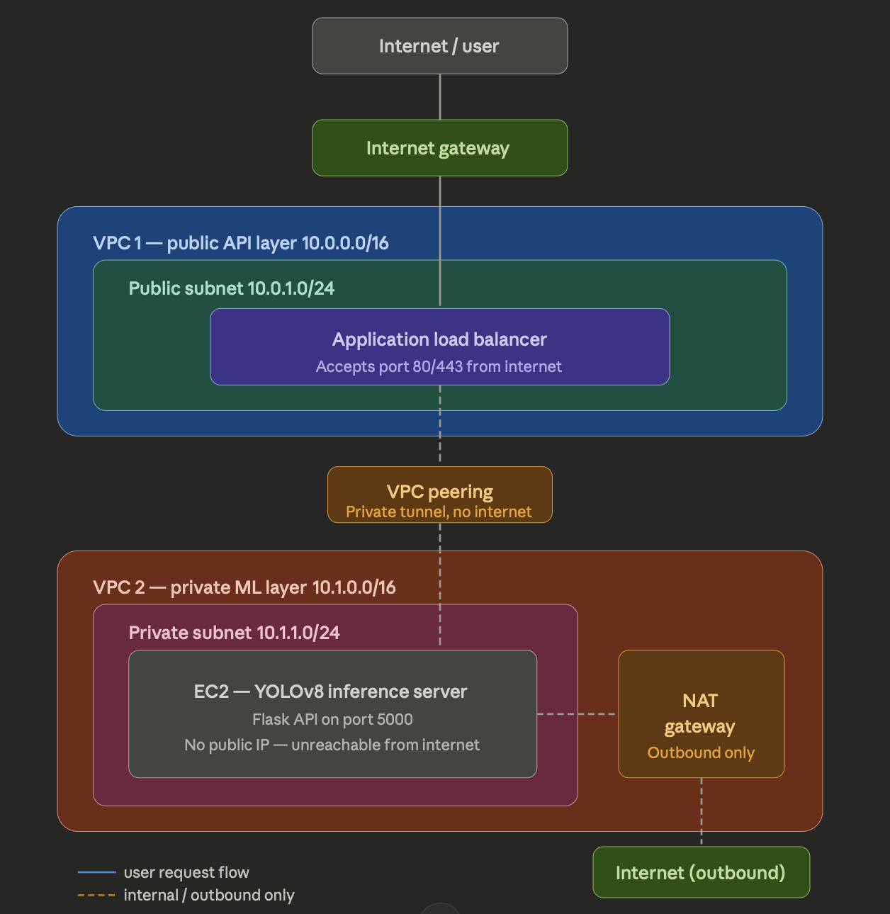
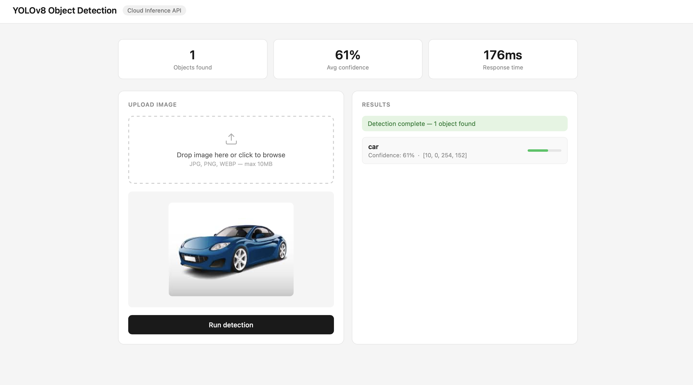
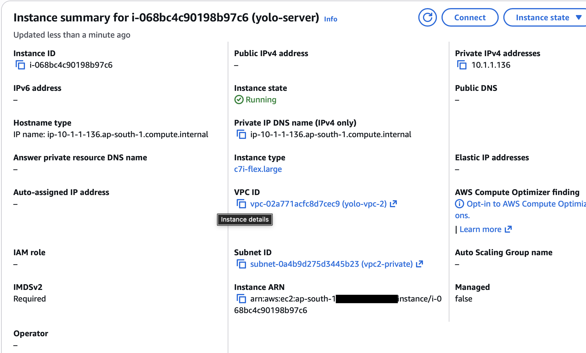
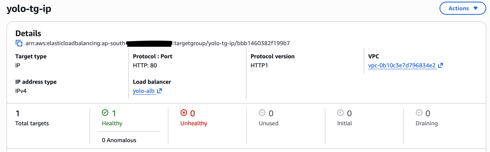
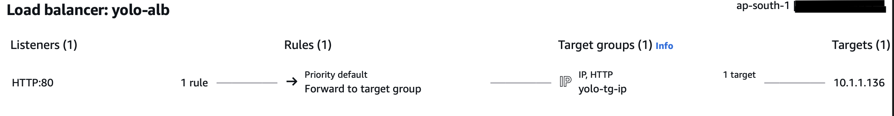
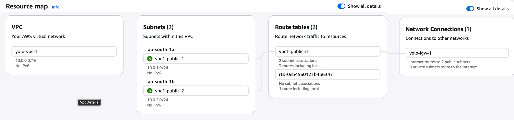
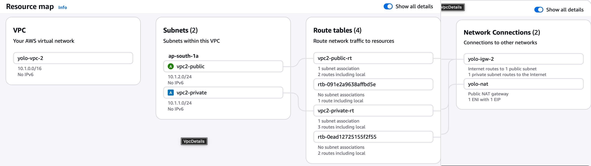

# Secure Dual-VPC Cloud Inference API for Car Detection

**Author:** Ayush Chandrakar | Vidyavardhaka College of Engineering (VVCE)

## Overview
This project is a fully decoupled, enterprise-grade cloud architecture built on AWS. It serves a custom YOLOv8 car detection model (Computer Vision) through a highly secure API. 

Instead of deploying the web server and the AI model on a single public machine, I designed a **Zero-Trust Dual-VPC architecture**. The frontend is executed locally, the API gateway faces the public internet, and the heavy ML processing server is completely hidden in a private network with no internet access. 

## The Architecture

### Simplified Data Flow

*A high-level view of how user traffic routes through the isolated networks.*

### Detailed Infrastructure Map

*The complete AWS resource and networking breakdown.*

### 1. The Frontend (Decoupled UI)
* **Where:** Local Machine / Web Browser
* **What it does:** A standalone, lightweight HTML/JS interface where users upload images. It uses the Fetch API to send HTTP POST requests directly to the cloud Load Balancer. Keeping the UI local ensures the backend compute is used 100% for AI processing, not serving web pages.

### 2. VPC 1: The Public DMZ (10.0.0.0/16)
* **Where:** Public Subnets
* **What it does:** Acts as the entry point. It contains an **Application Load Balancer (ALB)** that catches web traffic and a Bastion Host used strictly for secure SSH access by the developer.

### 3. VPC 2: The Private Vault (10.1.0.0/16)
* **Where:** Private Subnet
* **What it does:** Contains the main inference engine—an Ubuntu 22.04 EC2 instance (`c7i-flex.large`). This server has **no public IP address**. It is physically impossible to reach it from the open internet. It communicates outbound through a NAT Gateway to download required packages.

### 4. The Bridge: VPC Peering
To connect the ALB in VPC 1 to the private server in VPC 2, I established a **VPC Peering Connection** with custom Route Tables. The ALB routes traffic through this private tunnel directly to the EC2's private IPv4 address (`10.1.1.136`).

## Tech Stack
* **Cloud Infrastructure:** AWS (VPC, EC2 Ubuntu 22.04, ALB, NAT Gateway, Security Groups, VPC Peering)
* **Machine Learning:** YOLOv8 (Ultralytics), OpenCV
* **Backend API:** Python, Flask
* **Server Stack:** NGINX (Reverse Proxy), Gunicorn (WSGI), Systemd (Daemon management)
* **Frontend:** Vanilla HTML/CSS/JavaScript

---

## Proof of Work & System Health

Because AWS compute-optimized instances (`c7i-flex.large`) are expensive, this infrastructure is spun down when not in active use. Below is the visual proof of the system's successful deployment and network health.

### 1. Live Inference Result
The decoupled local HTML/JS frontend successfully routing a car image to the private backend and returning YOLOv8 bounding boxes in ~176ms.

### 2. Network Isolation (Zero Public Access)
The EC2 instance dashboard proving the server operates exclusively on a private IPv4 address (`10.1.1.136`) with no public IP attached.

### 3. Cross-VPC Health Check
The Target Group showing a "Healthy" status, proving the Application Load Balancer in VPC 1 is successfully communicating with NGINX in VPC 2 through the peering tunnel.

### 4. Traffic Management
The Load Balancer listener rules routing Port 80 traffic to the cross-network IP target. 

### 5. Subnet Isolation Maps
AWS Resource maps showing the exact routing structure of the public and private environments.
* **VPC 1 (Public Entry):**
    
* **VPC 2 (Private Processing):**
    

---

## Key Technical Learnings
* **Cross-VPC Routing:** Discovered that ALBs cannot target "Instance IDs" across different VPCs; it requires explicitly routing to the private IP address.
* **Linux Headless Environments:** Handled missing graphics drivers on Ubuntu cloud servers by manually configuring `libgl1` to prevent OpenCV crashes during bounding box generation.
* **Production WSGI:** Transitioned from a standard Flask development server to a production-ready NGINX + Gunicorn stack, managed via Systemd for automatic restarts.